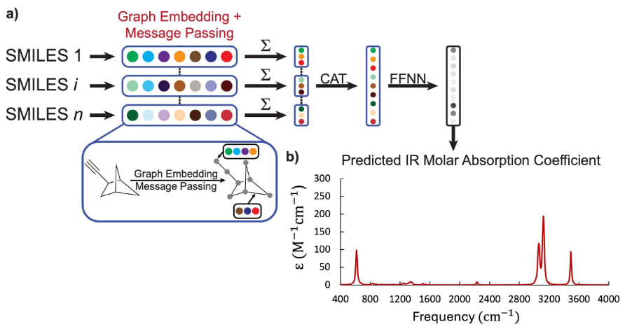

# Chemprop-IR-MolAbsorb

This repository contains the source code and supplementary materials developed for our paper:

**"Prediction of the Infrared Absorbance Intensities and Frequencies of Hydrocarbons: A Message Passing Neural Network Approach"**

This codebase was developed by extending [Chemprop-IR](https://github.com/gfm-collab/chemprop-IR) and incorporating the [CMPNN](https://github.com/SY575/CMPNN) algorithm. We gratefully acknowledge their open-source contributions.

**Overview**

  

*Figure: Model architecture and workflow used for predicting IR molar absorptivity spectra.*

**Citation:**

Shaban Tameh, M. et al. *The Journal of Physical Chemistry A*, 2024. DOI: [https://doi.org/10.1021/acs.jpca.4c06745)

